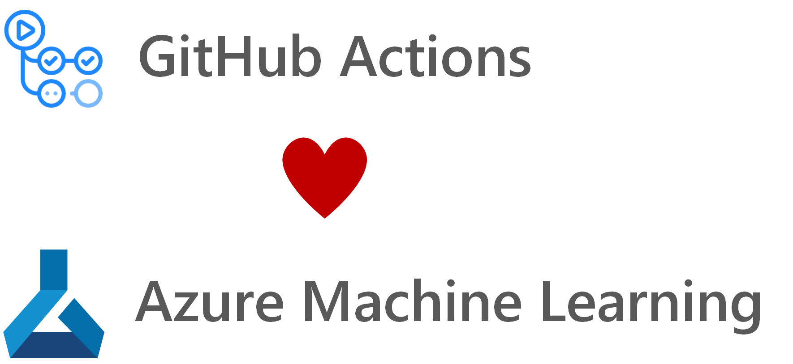

  

  

# ML DevOps with GitHub Actions and Azure ML

This repository demonstrates how to automate the machine learning lifecycle using the CI/CD pipeline tools of [GitHub Actions](https://github.com/features/actions) and [Azure Machine Learning](https://docs.microsoft.com/en-us/azure/machine-learning/) for training and deployment. The repository does not make use of Azure DevOps, but uses [GitHub Actions](https://github.com/features/actions) as a future proof backend system for workflow automation.

The repository includes the following features:
- [GitHub Actions](https://github.com/features/actions) for the continuous integration (CI) and continuous delivery (CD) pipeline
- [Azure Machine Learning](https://docs.microsoft.com/en-us/azure/machine-learning/) as a backend for training and deployment of machine learning models
- CI/CD pipeline as code: the repository uses the [Azure Machine Learning Python SDK](https://docs.microsoft.com/en-us/python/api/overview/azure/ml/intro?view=azure-ml-py) to define the CI/CD steps and implements almost all features of this framework
- Central settings file in json format to enable quick customization of of each step of the pipline

## Implemented Azure ML features in the CI/CD pipeline

The repository and the CI/CD pipeline makes use of the following key features of [Azure Machine Learning](https://docs.microsoft.com/en-us/azure/machine-learning/):
- Loading or deployment of Workspace
- Training on different compute engines: Azure Machine Learning Compute, Data Science VM, Remote VM
  - Automatically creates or attaches the compute engine, if it is not available yet
  - Allows extensive customizations of the compute engine depending on your requirements
- Granular adjustment of training process
  - Custom docker images and container registries
  - Distributed training backends: MPI, Parameter Server, Gloo, NCCL
  - Supports all frameworks: TensorFlow, PyTorch, SKLearn, Chainer, etc.
  - Registration of environment
  - Hyperparameter Tuning
- Comparison of models before registration in workspace
  - Comparison of production model and newly trained model based on metrics defined in central settings file
- Model profiling after training has completed successfully
  - Recommends number of CPUs and RAM size for deployment
- Deployment with testing in three phases:
  - Dev deployment: deployment on Azure Container Instance
  - Test deployment: deployment on Azure Kubernetes Service with purpose DEV_TEST
  - Production deployment: deployment on Azure Kubernetes Service with purpose FAST_PROD
- And many others ...

## What is ML DevOps?

  

MLOps empowers data scientists and app developers to bring together their knowledge and skills to simplify the model development as well as the release and deployment of them. ML DevOps enables you to track, version, test, certify and reuse assets in every part of the machine learning lifecycle and provides orchestration services to streamline managing this lifecycle. This allows to automate the end to end machine Learning lifecycle to frequently update models, test new models, and continuously roll out new ML models alongside your other applications and services.

This repository enables Data Scientists to focus on the training and deployment code of their machine learning project (`code` folder of this repository). Once new code is checked into the `code` folder of the master branch of this repository, the CI/CD pipeline is triggered and the training process starts automatically in the linked Azure Machine Learning workspace. Once the training process is completed successfully, the deployment of the model takes place in three stages: dev, test and production stage.

## Key challenges solved by ML DevOps

**Model reproducibility & versioning**
- Track, snapshot & manage assets used to create the model
- Enable collaboration and sharing of ML pipelines

**Model auditability & explainability**
- Maintain asset integrity & persist access control logs
- Certify model behavior meets regulatory & adversarial standards

**Model packaging & validation**
- Support model portability across a variety of platforms
- Certify model performance meets functional and latency requirements

**Model deployment & monitoring**
- Release models with confidence
- Monitor & know when to retrain by analyzing signals such as data drift

## Prerequisites

The following prerequisites are required to make this repository work:
- Azure subscription
- Contributor access to the Azure subscription
- Access to the [GitHub Actions Beta](https://github.com/features/actions)

If you don’t have an Azure subscription, create a free account before you begin. Try the [free or paid version of Azure Machine Learning](https://aka.ms/AMLFree) today.

## Settings file

The repository uses a central settings file in [`/aml_service/settings.json`](/aml_service/settings.json) to enable quick customizations of the end to end pipeline. The file can be found [here](/aml_service/settings.json) and can be used to adjust the parameters of:
- The compute engines for training and deployment,
- The training process (experiment and run) and
- The deployment process.

## GitHub Workflow

The GitHub Workflow requires the follwing secrets:
- `AZURE_CREDENTIALS`: Used for the az login action in the [GitHub Actions Workflow](https://github.com/features/actions). Please visit [this website](https://github.com/Azure/login#github-actions-for-deploying-to-azure) for a tutorial of this GitHub Action.
- `FRIENDLY_NAME`: Friendly name of the Azure ML workspace.
- `LOCATION`: Location of the workspace (e.g. `westeurope`, etc.)
- `RESOURCE_GROUP`: Resource group where Azure Machine Learning was or will be deployed.
- `SUBSCRIPTION_ID`: ID of the Azure subscription that should be used.
- `WORKSPACE_NAME`: Name of your workspace or the workspace that should be created by the pipeline.

## Further Links

- [GitHub Actions Documentation](https://help.github.com/en/github/automating-your-workflow-with-github-actions)
- [Azure Machine Learning Documentation](https://docs.microsoft.com/en-us/azure/machine-learning/)
- [Azure Machine Learning Python SDK Reference](https://docs.microsoft.com/en-us/python/api/overview/azure/ml/intro?view=azure-ml-py)
